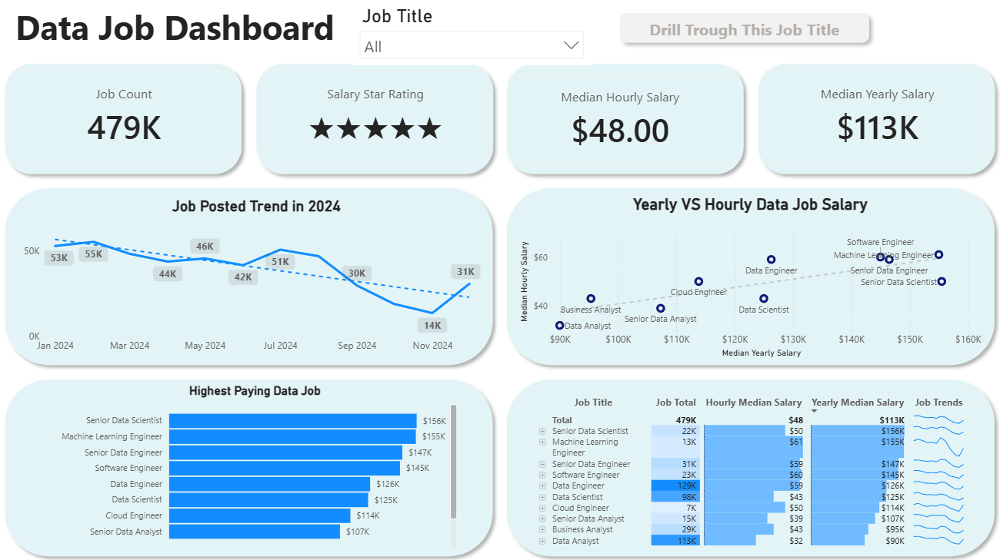

# Data Job Dashboard w/ Power BI
 

 
[View interactive dashboard here on the Power BI Service](https://your-powerbi-link-here.com)
 
## Introduction
 
This dashboard was built for **Job Seekers, Job Transitioners, and Job Swappers** who want a clearer picture of the data job market without digging through scattered listings and reports. Using a *real-world dataset of 2024 data job postings* (covering titles, salaries, locations, job boards, and employment types), this project brings everything into one interactive view so anyone can explore market trends and compensation in a few clicks.
 
## Skills Showcased
 
- **⚙️ Data Transformation (ETL) with Power Query:** Cleaned and reshaped the raw job postings data, handling blanks, fixing data types, and building new columns for analysis.
- **🧮 Implicit Measures:** Built measures to power key KPIs such as `Median Yearly Salary`, `Median Hourly Salary`, and `Job Count`.
- **📊 Core Charts:** Used **Column, Bar, Line, Scatter,** and **Donut Charts** to compare job counts, salary spread, and trends over time.
- **🗺️ Geospatial Analysis:** Used a **Map Chart** to visualize where data jobs are posted globally.
- **🔢 KPI Indicators, Gauges & Tables:** Used **Cards** and **Gauge charts** for quick-glance metrics, and **Tables** for detailed, sortable breakdowns.
- **🎨 Dashboard Design:** Designed a clean, rounded-card layout that keeps the report easy to scan while still surfacing detailed data on request.
- **🖱️ Interactive Reporting:**
  - **Slicers:** To dynamically filter the report by Job Title.
  - **Buttons & Bookmarks:** For smooth navigation between views.
  - **Drill-Through:** To move from a high-level overview into a focused, job-title-specific breakdown.
## Dashboard Overview
 
### Page 1: High-Level Market View
 

 
This is the main overview page. Four KPI cards sit at the top: **479K total jobs posted**, a **5-star Salary Star Rating**, a **$48.00 median hourly salary**, and a **$113K median yearly salary**.
 
#### Job Posted Trend in 2024
Postings peaked early in the year at 55K in February, then trended down for most of 2024, dropping to a low of 13.7K in November before picking back up slightly to 30.8K in December. Hiring was clearly heavier in Q1 and quieter toward the end of the year.
 
#### Yearly vs Hourly Data Job Salary
Pay scales together pretty consistently, roles paying more per year also pay more per hour. Data Analyst sits at the low end ($90K / $32 per hour), while Machine Learning Engineer and Senior Data Scientist sit at the top (roughly $155K / $60+ per hour).
 
#### Highest Paying Data Job
Senior Data Scientist ($156K) and Machine Learning Engineer ($155K) top the list, almost $66K above Data Analyst ($90K) at the bottom. There's a real gap between senior/ML-heavy roles and entry-level analyst positions.
 
#### Job Title Table
The highest-paying titles aren't the ones getting hired the most. Data Engineer (129K postings) and Data Analyst (113K postings) have by far the biggest job counts, even though their pay sits in the middle-to-lower range. Most of the actual hiring demand is coming from these roles.
 
### Page 2: Job Title Drill Through
 

 
This is the deep-dive page, reached by drilling through from any job title on Page 1, shown here for **Data Analyst**. It breaks down pay, benefits, and where the jobs are actually posted for that specific title.
 
#### Yearly & Hourly Salary
Median pay comes in at $90K yearly and $32/hr, but the range underneath is huge ($18K to $445K yearly, $8 to $140 hourly), so location, seniority, and company clearly play a big role here.
 
#### No Degree Mentioned / Health Insurance / Work From Home
Only **39%** of postings say no degree is required, **15%** mention health insurance, and just **10%** allow work from home. So for Data Analyst roles specifically, most listings still lean toward degree requirements, in-office work, and don't call out benefits.
 
#### Jobs Globally
The **United States** dominates with 39,905 job offers at a $91,050 median salary. Rounding out the top 5: **United Kingdom** (8,881 jobs, $76,959), **France** (8,049 jobs, $90,000), **India** (4,753 jobs, $73,918), and **Germany** (4,705 jobs, $86,875).
 
#### What Are The Most Demanded Job?
**LinkedIn** is the top platform by a wide margin with 35,422 postings, followed by BeBee (13,865) and Indeed (9,753). LinkedIn is clearly where most of this hiring activity is happening.
 
#### Data Job Type
Most postings are **Full-time (87.73%)**, with Contractor (6.97%), Internship (2.41%), and Part-time (1.97%) making up the rest. Data Analyst hiring is still mostly a full-time job market.
 
## Conclusion
 
This dashboard shows how Power BI can turn raw, scattered job posting data into a clear, interactive tool for career research. By combining a high-level market overview with a detailed drill-through per job title, users can slice, filter, and explore the data on their own terms, helping them make more informed decisions about which data role, market, or platform to focus on next.
 
